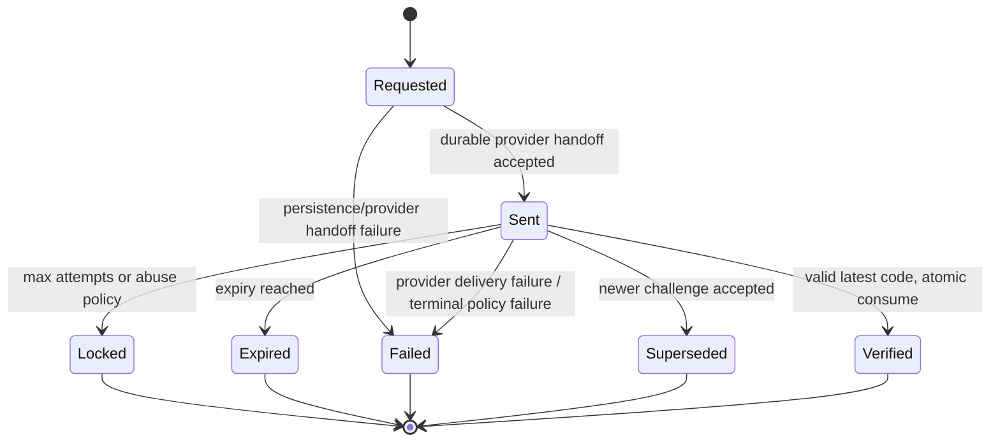
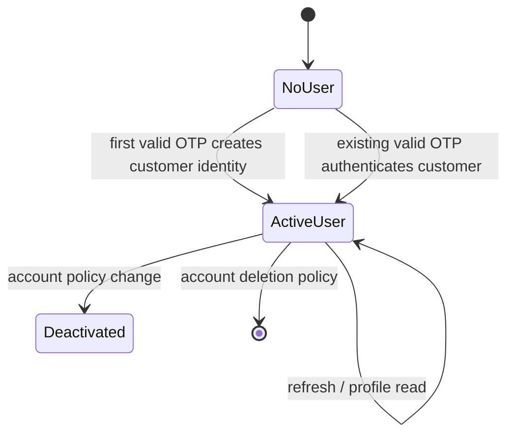
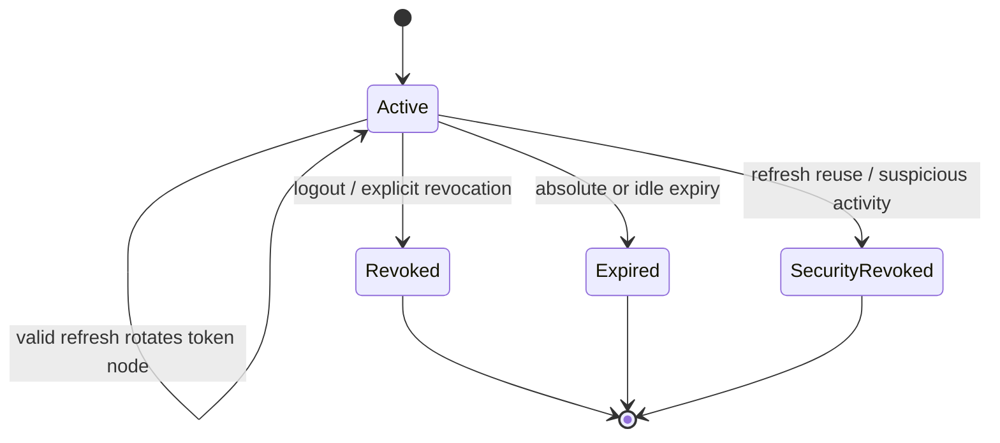
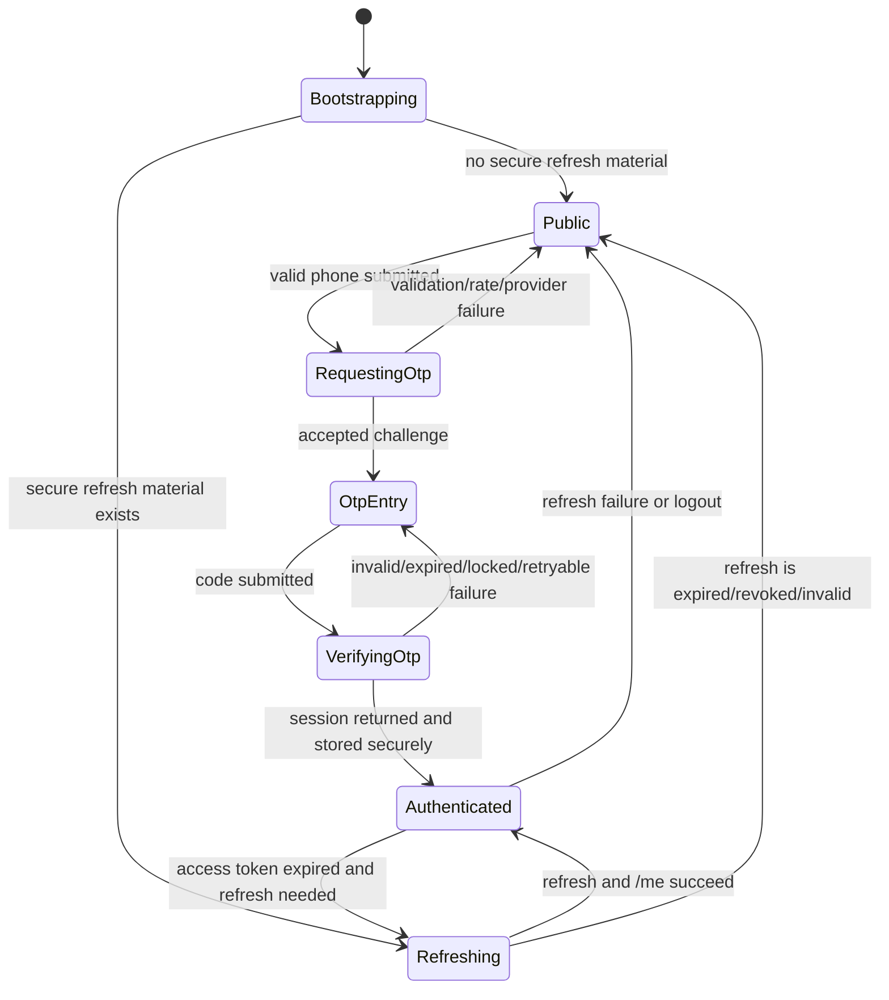

# Slice 1 Authentication State Machines

Status: design only, no authentication implementation

## OTP challenge lifecycle

Rules:

- Only `Sent` and not-expired challenges can verify.
- `Verified`, `Expired`, `Locked`, `Failed`, and `Superseded` are terminal.
- A newer accepted challenge supersedes the prior challenge for the same normalized phone/security subject.
- Attempt increments and terminal transitions are atomic. The exact OTP lifetime, attempt limit, resend cooldown, and request windows are configuration requiring approval.
- Delivery failure must not leave an apparently usable challenge without a durable retry/terminal result.

## User/session lifecycle

User identity is database state. A client cannot create or transition an identity by editing local state.

## Session lifecycle

A session family contains rotated refresh-token nodes. Consuming a token node is an atomic state transition. Reuse of any consumed node revokes the family, not just the presented node.

## Mobile navigation state

Navigation is a projection of server/session state. Zustand may hold transient auth phase and in-memory access token status; TanStack Query owns `/auth/me`; SecureStore owns refresh material; Expo Router route groups enforce public/protected presentation.

## Required transitions and guards

- Public user opening a protected route: redirect to Login and preserve only a non-sensitive return path.
- Authenticated user opening Login: redirect to protected Home or current bootstrap target.
- Access token expiry: one coordinated refresh; replay the original idempotent read once; never loop.
- Refresh expiry/revocation/reuse: clear secure state and customer query cache, route to Login, and require OTP.
- Logout: call server revoke when possible, then clear local state regardless of response.
- App restart: bootstrap from SecureStore, refresh, then fetch `/auth/me`; never infer authentication from a local boolean.
- Multiple devices: each device has a separate session; revoking one does not affect another unless the user/security policy explicitly chooses all sessions.
